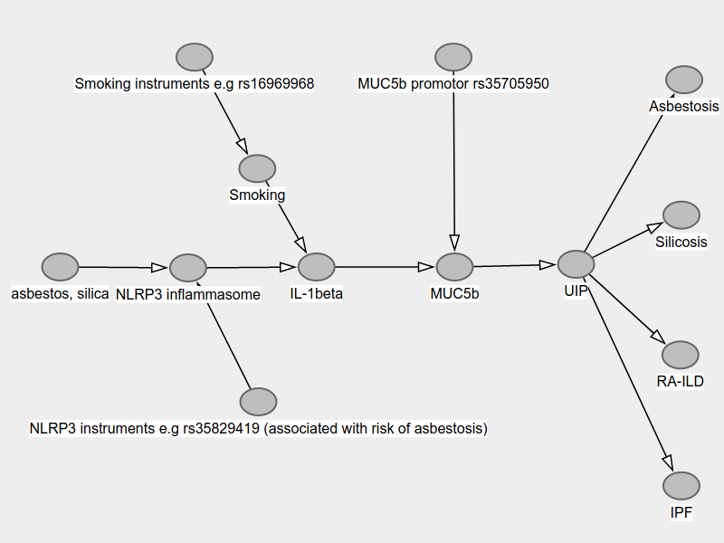

# From lab bench to work bench: Do variants within NLRP3 inflammasome related genes alter the risk of Idiopathic Pulmonary Fibrosis (IPF) in patients with occupational exposure to asbestos or crystalline silica?

I hypothesise that *occupational asbestos and respirable crystalline silica induced activation of the NLRP3 inflammasome causes IPF via IL-1beta stimulated MUC5b hypersecretion in smokers*. To test this I will apply a validated job exposure matrix to case-control study data from the Idiopathic Pulmonary Fibrosis Job Exposures Study. I will genotype the same cohort for the key MUC5b promotor polymorphism rs35705950, for polymorphisms in the NLRP3 inflammasome genes Nalp3, caspase-1, and IL-1beta, associated with enhanced IL-1beta release, and polymorphisms in genes associated with cigarette smoking. Because polymorphisms are randomly distributed in the population (mendelian randomisation) any associations with IPF would support a causal relationship providing certain assumptions hold, namely that the genetic variants associate with the risk factors of interest, are independent of the outcome, and only affect the outcome through their effect on the risk factor of interest.[@Davies2018] 

Idiopathic pulmonary fibrosis (IPF) is a progressive, fibrotic lung disease which in 2016 was the recorded cause of death for approximately 5000 people in England and Wales. Its incidence, currently around 7.5/100,000 person-years, has increased by 5% per annum in the period 1979-2016.[@Navaratnam2011][@Navaratnam2019] The diagnosis is made when there are characteristic honeycomb cystic changes, called usual interstitial pneumonia (UIP), on high resolution CT or biopsy once known causes of interstitial lung disease (such as drug toxicity, connective tissue disease, domestic, and occupational or environmental exposures) have been excluded.[@Raghu2018] However, a recent meta-analysis of epidemiological studies estimated 26% of cases may be attributable to occupational exposures, including to metal, silica, wood, and agricultural dusts.[@Blanc2019] Asbestosis, silicosis, chronic hypersensitivity pneumonitis, and rheumatoid arthritis-associated ILD can all give rise to UIP[@Arakawa2007][@Wuyts2014] and the potential for misdiagnosis as IPF is well recognised.[@Monso1991][@Morell2013] In light of this there have been calls for the systematic capture of key occupational and environmental data to elucidate specific causal exposures and improve diagnostic specificity.[@Nett2019]  

The 'Idiopathic Pulmonary Fibrosis Job Exposures Study' (IPFJES) collected lifetime occupational histories, DNA, and serum for 494 IPF cases and 466 hospital controls to investigate asbestos exposure in the aetiology of IPF. IPFJES was designed to overcome the risk of bias present in previous case-control studies due to low control participation rates and the use of binary self-reported exposure measures, and to permit investigation of gene-environment interaction. Smoking appeared to interact with occupational asbestos exposure to increase risk of IPF in participants carrying one or more copies of the minor allele of rs35705950 (manuscript in preparation), this common variant is the strongest identified genetic risk factor for IPF; minor allele frequency > 0.1 in Caucasian populations, OR 4.84 (95%CI 4.37-5.36, p=1.18x10^-203^) in a recent genome wide association study (GWAS) meta-analysis (total 2,668 IPF cases and 8,591 controls).[@Allen2019] Its main effect is to increase airway expression of a distal airway glycopeptide called MUC5b (>30-fold).[@Evans2016] MUC5b is a dominant constituent of the honeycomb cysts that characterise IPF.[@Seibold2013] It has recently emerged that rs3505950 is also a risk factor for asbestosis[@Platenburg2020], chronic hypersensitivity pneumonitis, and rheumatoid arthritis associated ILD.[@Namba2019]

There is strong intuitive sense for occult occupational inhalation of silica or asbestos fibres being an under-recognised cause of IPF since both are known to be fibrogenic and are frequently used in animal models of pulmonary fibrosis.[@BMoore2013] Interestingly, both silica and asbestos exposure also result in production of IL-1beta, via the NLRP3 inflammasome in a process that appears to be dependant on reactive oxygen species (ROS). IL-1beta is known to be a key proinflammatory cytokine in IPF and a potent stimulus for MUC5b expression.[@Dostert2008] Smoking cigarettes results in ROS exposure and is thought to increase the risk of asbestosis, silicosis, and IPF.[@Baumgartner1997][@Mossman1998] Of note, the lungs can also be an initiating site of rheumatoid arthritis.[@Catrina2016] Occupational exposure to respirable crystalline silica is associated with an increased risk of rheumatoid arthritis in men[@Stolt2010], and rheumatoid arthritis associated ILD (which causes UIP) is more common in men despite rheumatoid arthritis being more common in women.[@Rosenman2012] Genetic variants in the NLRP3 inflammasome (e.g rs35829419) have been found to be associated with increased risks of rheumatoid arthritis[@Mathews2014], asbestosis[@Kukkonen2014], coal workers pneumoconiosis[@Ji2012] (which is also associated with a MUC5b promoter SNP[@Ji2014]), and susceptibility to infection.[@Pontillo2012][@Abate2019]   

Additional evidence for the importance of common pathways in UIP-related disease is provided by the demonstration of the effectiveness of the anti-fibrotic nintedanib, a treatment licensed for IPF, in non-IPF UIP[@Flaherty2019] and the observation that it is also effective in animal models of silicosis.[@Wollin2015] It is also intriguing that IBD-like colitis has been observed as a side effect of antifibrotic agents; NLRP3 inflammasome variants are strongly implicated in IBD.[@Fiddler2016]

In summary, there is (i) recognition that a proportion of IPF is associated with unrecognised occupational exposures; (ii) convergence on the importance of excessive MUC5b expression in several diseases that can cause UIP, some of which e.g silicosis, asbestosis, are occupational; (iii) a plausible biological mechanism, namely alveolar macrophage NLRP3 inflammasome activation and increased IL-1beta expression. The latter leads to increased MUC5b expression, impaired mucociliary clearance, greater alveolar epithelial exposure to injurious agents (infectious or otherwise), and UIP.

Mendelian randomization (MR) is a technique that uses randomly distributed genetic variants as natural experiments to provide evidence about putative causal relations between modifiable risk factors and disease.[@Davies2018] Through its use of genetic variance it can overcome problems of confounding and reverse causality. MR can be used within a case-control study design to help triangulate suspected causal associations.[@Lawlor2016] It could be usefully applied to IPFJES to investigate interactions between occupational silica and asbestos exposure, smoking, and NLRP3 inflammasome variants, with respect to IPF risk, in order to better understand the aetiology of IPF and potentially identify new therapeutic targets.

During my fellowship I will pioneer the use of novel methods in occupational lung disease beginning with mendelian randomisation in IPF to investigate causal occupational exposure-response pathways.

Immediate research plans (costed within this grant):
- Occupational phenotyping of IPF; in particular assessing occupational asbestos and silica exposure through well validated quantitative means
- Genotyping IPFJES cohort for SNPs in the NLRP3 inflammasome associated with enhanced IL-1beta release 
- Genotyping IPFJES cohort for SNPs associated with smoking 

Further research plans:
- Exome sequencing IPFJES cohort
- Updating existing GWAS meta-analysis to perform the largest meta-analysis of IPF to date
- Carrying out the first two-sample MR studies of risk factors in IPF (to isolate the NLRP3 inflammasome) including smoking, gastro-oesophageal reflux disease, iron status, and cytokine profiles in IPF
- Colocalisation study of GWAS NRLP3 inflammasome loci across asbestosis, silicosis, RA, CHP, and IPF

My research plans are deliberately non-sequential. Occupational phenotyping for asbestos and silica will make use of already collected lifetime occupational histories coded to the standard occupational classification 1990 which will permit application of validated job-exposure matrices. DNA has already been extracted for the IPFJES cohort and commercial taqman assays for genotyping my SNPs of interest are readily available. Participants in IPFJES consented for future research including GWAS and collaboration, and data sharing with, commercial organisations. I will arrange exome sequencing externally and have identified an interested commercial partner to meet the modest associated costs. Instruments for performing two-sample MR studies of smoking, GORD, iron status, and cytokine profiles in IPF are readily available from exposure GWAS.[@Wootton2019][@An2019][@Gill2019][@Georgakis2019] Variant summary data from a recent pooled meta-analysis of IPF GWAS is available for academic research on application.[@Allen2019] 

\newpage

# Figures 

\newpage

# References

